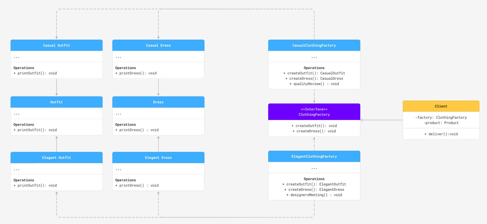

# Abstract Factory
Implementation that allows creation of related objects without specifying their concrete classes.

## References

This implementation utilizes ASCII art found in the following ASCII Art Archive:

https://www.asciiart.eu/clothing-and-accessories/dresses
https://www.asciiart.eu/clothing-and-accessories/shirts
https://www.asciiart.eu/clothing-and-accessories/pants

Art by Riitta Rasimus
